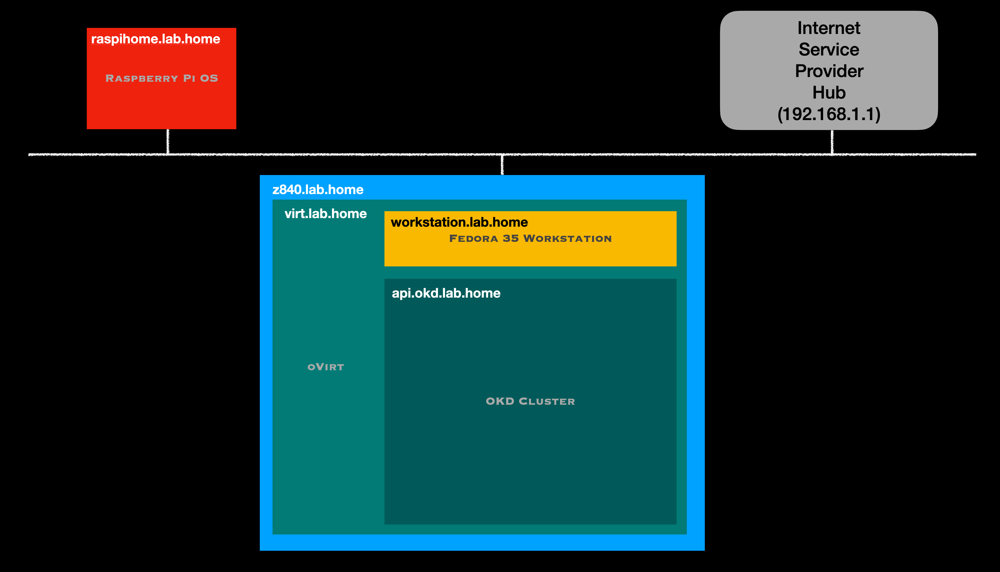

# My setup

<!--- cSpell:ignore dnsmasq NVME Hyperconverged homelab homeLab -->

This page details the setup for my home lab

{style="width: 80%" .center}

## Hardware

There are 2 systems the make up the lab hardware:

- Raspberry Pi 4 for network services
- Refurbished HP Z840 Workstation for the main Lab system

## Raspberry Pi 4

- System : Raspberry Pi 4
- Memory : 8GB Memory
- Storage : 1TB SSD external disk connected via USB 3

The Raspberry Pi provides the core network services needed for the Home lab.

Many Internet Service Providers provide a *home hub* that will suffice for most home environments, but my hub doesn't provide the DHCP and DNS services I need to run my home lab, so I disabled the basic DHCP service offered by my ISP hub and setup a Raspberry Pi single board computer to provide the network services for my home network.

[Dnsmasq](https://thekelleys.org.uk/dnsmasq/doc.html){target=_blank} provides both DHCP and DNS services.  It is easy to setup and ideal for a home lab.  I run Dnsmasq on a raspberry Pi as part of my home network setup.

## HP Z840 Workstation

- System : Refurbished Z840 Workstation
- CPU   : 2 X Intel Xeon E5-2697 V4 2.30Ghz 18 Core CPUs
- Memory : 384GB
- Storage :
    - 2TB SSD NVME M.2 - Boot disk
    - 4 x 6TB SATA 7200rpm Disks configured as 10.9 TB LSI RAID 10 volume
    - 2 X 2TB SATA SSDs configured as 3.64 TB LSI RAID 0 volume

The z840 is setup as a single node oVirt and Gluster Hyperconverged system.  The LSI RAID volumes are used exclusively as gluster volumes, so oVirt and OKD have access to both fast SSD and slower HD storage.

The systems are connected with 1GB networking using unmanaged switches and cat 6 cables.

## Network setup

I run the lab environment on my home ethernet network, which is not exposed on the internet, so all the name resolution is entirely within my local LAN, so I've not purchased any domain for the home lab.

- Base domain name : lab.home
- OKD Cluster name : okd
