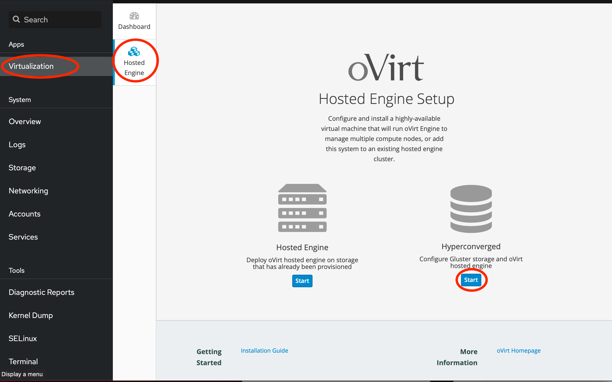
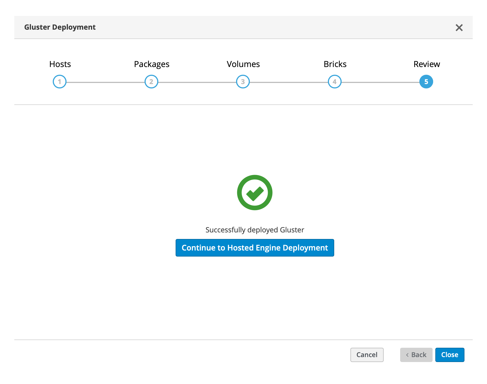

# oVirt installation and setup

<!--- cSpell:ignore passwordless OOMY hyperconverged vdsm firewalld wipefs remoteviewer virt jeffreywildman -->

## Install oVirt node

- [download ISO](https://ovirt.org/download/){: target=_blank}.  You want the [oVirt Node](https://resources.ovirt.org/pub/ovirt-4.4/iso/ovirt-node-ng-installer/){: target=_blank} ISO.
- flash to USB memory stick
- Boot from memory stick

## Run oVirt setup wizard

1. Select language from the list then press the **Continue** button
2. Select the keyboard layout then press the **Done** key
3. Enter the **Installation Destination** section
    - you need to keep a disk or partition free for Gluster to use (this was discussed in the [preparation](./preparation.md){: target=_blank} section)
4. Enter a root password
5. Set the TimeZone
6. Enter the Network and Host name section (ovirt host details - **z840.home.lab** in my setup)
    - select **Configure** to configure the network interface
    - In the IPv4 tab select **Manual** configuration then select **Add** to enter the configuration - this should match what is in your DNS configuration.  Press **Save** to store the IP configuration
    - Click the toggle switch to enable the Ethernet interface
    - Select Done to complete the network configuration
7. (optional) If you want to configure NTP time synchronisation, revisit the **Time & Date** section and configure the NTP server to a local server then enable NTP
8. Select **Begin Installation** to start the installation
9. Wait for installation to complete then select to reboot when selected (ensure the USB memory stick is removed so it doesn't boot from the install media)
10. You can now interact with the installed system using the web based cockpit UI.  On your laptop or a workstation on the network, navigate to ```https://<host address>:9090```.  Where the host address is the address you added in DNS for the IP address you manually configured in step 6 above.

## (Optional) Create partition for Gluster filesystem

If you are using a disk partition for the Gluster FS, then you need to create the partition.  In the cockpit UI, navigate to the **Storage** section.  Select the disk where the partition will live from the side panel.  This will show the partitions in the Content section.  Next to the unallocated space there is a **Create partition** button.  Click the button to create a partition.  Set the required size and select **No filesystem** as the type then click **Create partition**  to create the partition.

## Setup ssh keys

During the install the ansible scripts need to be able to execute commands on the host.  To do this it uses passwordless ssh.  Even though we are only using a single host, the scripts are written to work across multiple hosts, so we need to enable passwordless ssh.

You need to know your host IP address to substitute into ```ssh-copy-id``` command.  You can find your host address using command ```hostname -I```

Enter the following commands using the terminal section of the cockpit web console (```http://<host-address>:9090```) for the oVirt host.  Substitute your host address in the copy command, accept all defaults and leave the passphrase blank:

``` shell
ssh-keygen
ssh-copy-id root@<host-address>
```

you will be prompted to confirm the connection, answer **yes** then you will be prompted for the root password, which you entered in step 4 of the previous section.

## Configure LVM filter (not required for oVirt 4.5.4 and later)

By default Logical Volumes are configured to specific devices, so you need to add the device you want to use for the Gluster storage.

Using the terminal section in the cockpit web ui, edit file **/etc/lvm/lvm.conf** and search for a line the starts **filter =**, not lines starting with **#** are comments.

Modify the line to include your chosen device for the gluster volumes,

eg.  If the filter is currently set to ```filter = ["a|^/dev/disk/by-id/lvm-pv-uuid-U77HZ9-LPry-OOMY-bgOq-t34w-l3av-srg8tU$|", "r|.*|"]``` and your chosen device is **/dev/sdb**, then the filter line needs to be modified to:

```text
filter = ["a|^/dev/disk/by-id/lvm-pv-uuid-U77HZ9-LPry-OOMY-bgOq-t34w-l3av-srg8tU$|", "a|^/dev/sdb|", "r|.*|"]
```

Save the modified lvm.conf file

!!!Note
    If you plan to use an entire disk for GlusterFS, then it is important that the disk is not partitioned, so if it has previously been used and has a partition table on it, then use the **Terminal** section of the cockpit interface to clear the device.  E.g. if you will be using the disk **/dev/sdb** for gluster, then wipe the disk using command ```wipefs -a -f /dev/sdb```.  This will erase the disk.

## Setup the hyperconverged oVirt Hosted Engine and Gluster storage

!!!Note
    There is a mismatch in Ansible versions so fixup is needed before running setup wizard on oVirt 4.5.4.  See [this git issue](https://github.com/gluster/gluster-ansible-infra/issues/135){target=_blank}.  You need to run the following in the terminal panel of your host machine:
    
    ```shell
    sed -i 's/output | to_json/output/' /etc/ansible/roles/gluster.infra/roles/backend_setup/tasks/get_vg_groupings.yml
    sed -i 's/output | to_json/output/' /etc/ansible/roles/gluster.infra/roles/backend_setup/tasks/thick_lv_create.yml
    sed -i 's/output | to_json/output/' /etc/ansible/roles/gluster.infra/roles/backend_setup/tasks/thin_pool_create.yml
    sed -i 's/output | to_json/output/' /etc/ansible/roles/gluster.infra/roles/backend_setup/tasks/thin_volume_create.yml
    ```

The hyperconverged Hosted Engine and Gluster storage can be installed using the cockpit web console (```http://<host-address>:9090```).

In the Cockpit UI navigate to the **Virtualization** section in the side menu, then select the Hosted Engine section.



Select the start button under Hyperconverged.

Select the **Run Gluster Wizard for Single Node** option to start the install.

!!!Note
    Step 5 is only required in oVirt versions 4.4.6 and earlier, from 4.4.7 the installer works without needing to modify the generated config

1. Enter the Fully qualified hostname for the oVirt cluster (this should be the name of the oVirt node that was used during the ```ssh-copy-id``` command)
2. You can leave the Packages options as default
3. You can leave the Volumes options as default.  However, if you have a small amount of storage you may want to delete 2 of the 3 default volumes, so all available storage will be in a single volume.
4. In the Bricks options, set the device to the device you have available for the gluster storage for all the configured volumes.  This could be an entire disk (e.g. /dev/sdb), or an available disk partition (/dev/sda3)
5. *(only for earlier versions of oVirt)* In the review section edit the summary and remove the line ```- 5900/tcp```, as this will cause the scripts to fail. Save the script
6. Select the Deploy button to start the Gluster Storage installation

If all works you should see the screen confirming the Gluster installation was successful



You can now select the **Continue to Hosted Engine Deployment** button to install the Hosted Engine.

## Install Hosted Engine

The Hosted Engine will try to add port 6900 to the public zone and will fail as the port is already being exposed.  Before installing the Hosted Engine you need to modify the firewall configuration.

### Modify the firewall rules

!!!Info
    This step was needed in versions of ovirt before 4.4.9, but is no longer needed with 4.4.10

You need to modify the firewall config to remove port 6900 to ensure the automated deployment will work.

1. Switch to the terminal section and edit the file **/etc/firewalld/zones/public.xml** to have the following content:

    ```xml
    <zone>
      <short>Public</short>
      <description>For use in public areas. You do not trust the other computers on networks to not harm your computer. Only selected incoming connections are accepted.</description>
      <service name="ssh"/>
      <service name="dhcpv6-client"/>
      <service name="cockpit"/>
      <service name="libvirt"/>
      <service name="libvirt-tls"/>
      <service name="glusterfs"/>
      <service name="custom-vdsm"/>
      <port port="2049" protocol="tcp"/>
      <port port="54321" protocol="tcp"/>
      <port port="5900-6899" protocol="tcp"/>
      <port port="6901-6923" protocol="tcp"/>
      <port port="5666" protocol="tcp"/>
      <port port="16514" protocol="tcp"/>
    </zone>
    ```

    You can see the port range 5900-6923 has been split into 2 ranges avoiding port 6900

2. run command ```systemctl restart firewalld``` to make the new firewall configuration live.  You can now return to the Virtualization section of the Cockpit web console to continue with the Hosted Engine deployment.

### Install the Hosted Engine

Select to Deploy the Hosted Engine

1. In the VM Settings section enter:
    - the fully qualified host name for the hosted engine (**virt.home.lab** in my setup)
    - switch to static Network Configuration and set the IP address to the value matching your hostname in your DNS, the gateway address and DNS server address
    - enter the root password you want to set for the hosted engine operating system
    - select **Next** to move to Engine section
2. In the Engine section enter the admin password you want to set for the Engine, then select **Next to move to the next section
3. Review the configuration information then press **Prepare VM** to deploy the Hosted Engine virtual machine in the Prepare VM section, this can take a while
4. When the VM has been setup press **Next** to complete the setup
5. In the storage section the settings should be pre-populated, so you can press **Next** then **Finish Deployment**

## Setup Console viewing app

oVirt uses the SPICE protocol to access a hosted virtual machine.  You need to have a console viewing application installed on your system.  Details can be found [here](https://www.spice-space.org/download.html){target=_blank}

### oVirt machine console on macOS

Setting up the console viewer on MacOS can be a little more involved.  

When using [Homebrew](){target=_blank}, issue the following commands on the command line:

- brew install gtk+3
- brew tap jeffreywildman/homebrew-virt-manager
- brew install remoteviewer

then follow the [instructions](https://rizvir.com/articles/ovirt-mac-console/){target=_blank} to setup the association of **.vv** files to the remote-viewer application.
